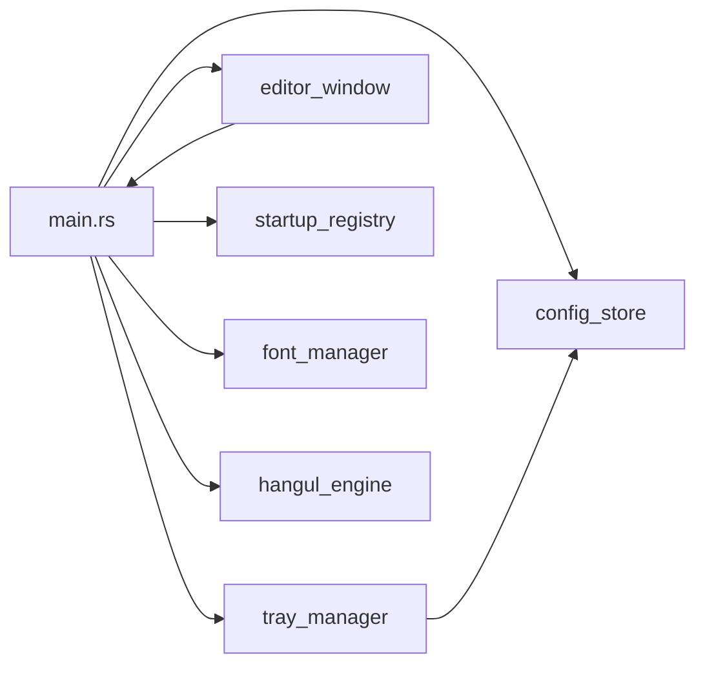
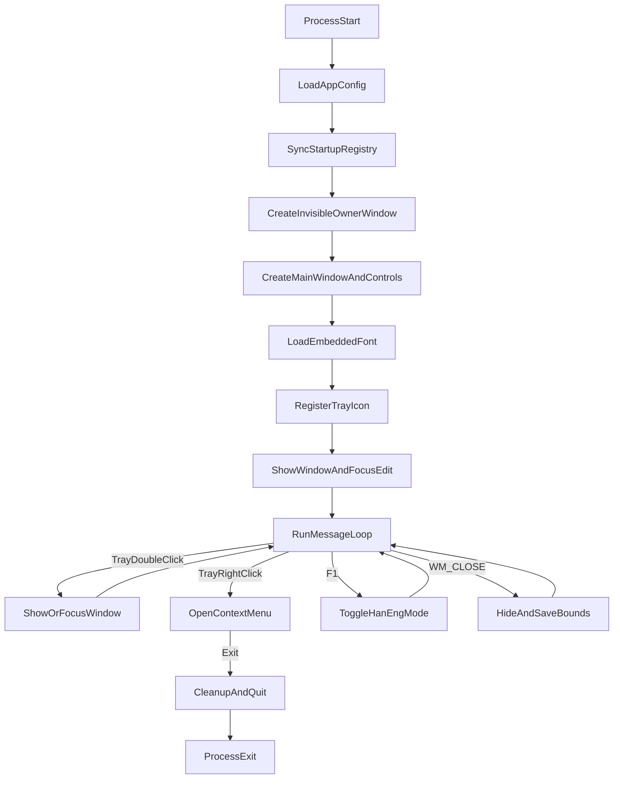
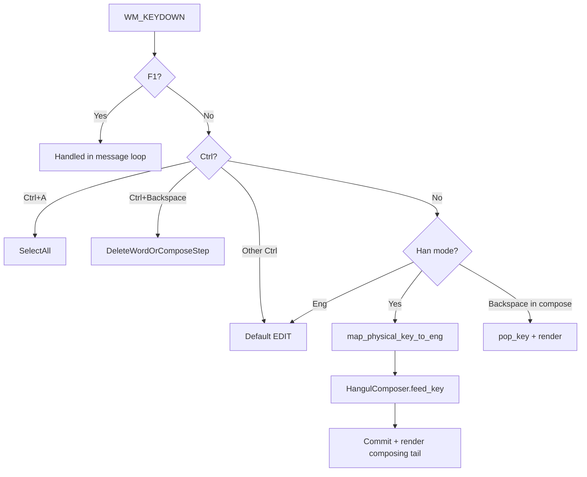

# gksrmf — 동작 구조 및 기능 사양 (상세설계)

> 대상: Windows 10/11 Win32 네이티브 단일 프로세스 트레이 앱
>
> 기준: 현재 구현 상태 (v0.1.0)
>
> **서비스사양**: [.cursor/rules/project-standards.mdc](../.cursor/rules/project-standards.mdc)

---

## 1. 목적 및 범위

### 1.1 목적

- 한글 키보드 레이아웃이 설치되지 않은 환경에서도 QWERTY 물리키로 두벌식 한글 입력이 가능하도록 한다.
- 트레이 상주형 경량 앱으로 실행 후 즉시 입력창에서 타이핑할 수 있게 한다.
- 웹뷰·대형 런타임 없이 Rust + Win32로 포터블하게 동작한다.

### 1.2 In-Scope

- 입력 창 포커스 안에서 `WM_KEYDOWN` 물리키 → 두벌식 한글 완성형 조합
- 한/영 모드 전환 (상태바 클릭, F1)
- 상태바 항상 위 체크박스, 트레이 컨텍스트 메뉴
- 설정 영속화(JSON), 창 위치·크기 저장, 시작 프로그램 레지스트리 동기화
- 내장 한글 폰트 (Noto Sans CJK KR)
- Windows 표준 Unicode 클립보드 복사/붙여넣기

### 1.3 Out-of-Scope

- 웹/모바일/크로스플랫폼 GUI 프레임워크 전환
- 계정, 동기화, 클라우드 저장
- macOS/Linux 포팅
- 전역 물리키 훅 (다른 앱 포커스에서의 입력 변환)
- UTF-8 바이트 전용 클립보드 복사 (별도 기능으로만 검토)

### 1.4 런타임 특성

- Rust 2021, Win32 `W` API
- 단일 실행 파일, 무설치(포터블) 지향
- 릴리스: `lto`, `strip`, `opt-level = "z"`

---

## 2. 핵심 설계 결정

### 2.1 입력 모델 (현재 구현)

- **물리키 기반 조합**을 사용한다. `EDIT` subclass `edit_proc`에서 `WM_KEYDOWN`을 가로챈다.
- `map_physical_key_to_eng`로 가상키를 두벌식 영문 키로 매핑한 뒤 `HangulComposer::feed_key`에 전달한다.
- 조합 중 텍스트는 `EM_REPLACESEL`로 선택 영역만 갱신하고, 확정분(`committed`)은 즉시 커밋한다.
- 초기 `EN_CHANGE` 후처리 방식은 제거했다. (`doc/issues/01-input-model-physical-key.md` 참고)

### 2.2 조합 tail 분리

- Backspace 시 전체 키 버퍼 재변환으로 앞 음절이 오염되는 문제를 막기 위해 `ComposerStep { committed, composing }`를 사용한다.
- `pop_key()`는 마지막 키 1타만 되돌린다. 예: `한국어이` → Backspace → `한국어ㅇ`.

### 2.3 한/영 모드

- 오른쪽 Alt 토글은 Windows 시스템 키 충돌로 **채택하지 않음**.
- 상태바 `[한] | 영` 버튼 클릭 또는 **F1**으로 전환.
- 한 모드: 물리키 조합. 영 모드: 기본 `EDIT` 동작에 위임.

### 2.4 문자 인코딩 및 클립보드 정책

- 앱 내부: Rust `String` (UTF-8)
- Win32 `EDIT` / `W` API: UTF-16
- 클립보드: Windows 표준 `CF_UNICODETEXT` (UTF-16LE)
- 기본 `Ctrl+C`는 표준 유니코드 텍스트 복사 유지. UTF-8 바이트가 필요하면 별도보내기 기능으로 검토.

### 2.5 폰트

- Noto Sans CJK KR Regular를 `include_bytes`로 내장, `AddFontMemResourceEx` 등록 후 `WM_SETFONT` 적용.
- 등록 실패 시 시스템 기본 폰트 fallback.

---

## 3. 모듈 구조 및 책임



| 모듈 | 파일 | 역할 |
|---|---|---|
| 앱 진입점 | `src/main.rs` | `wnd_proc`, `edit_proc`, 메시지 루프, 전역 상태, F1 토글 |
| 트레이 | `src/tray_manager.rs` | 아이콘 등록, 테마별 아이콘, 컨텍스트 메뉴, 창 표시/포커스 |
| 에디터 창 | `src/editor_window.rs` | 메인 창 자식 컨트롤 생성·리사이즈, 항상 위 적용 |
| 한글 엔진 | `src/hangul_engine.rs` | `HangulComposer`, `convert_eng_to_kor`, 조합 테이블 |
| 설정 | `src/config_store.rs` | `config.json` 로드/저장 |
| 시작 프로그램 | `src/startup_registry.rs` | `HKCU\...\Run` 등록/해제 |
| 폰트 | `src/font_manager.rs` | 내장 폰트 메모리 등록, `HFONT` 생성·해제 |

> `input_adapter.rs`는 별도 모듈로 분리하지 않았다. 입력 라우팅은 `main.rs`의 `edit_proc`에 있다.

---

## 4. 기동~종료 생명주기



---

## 5. UI 상세 설계

### 5.1 메인 창

- 기본 크기: 500×500 (`config.json`에서 복원 가능)
- 최초 실행: 창 표시 + 에디터 포커스
- 닫기·최소화: 트레이로 숨김 (종료 아님), 위치·크기 저장
- 작업 표시줄: 미표시 (invisible owner 창 패턴)
- 리사이즈: `WS_THICKFRAME`, 에디터 외곽 8px 마진

### 5.2 상태바 (높이 32px)

| 컨트롤 | ID | 설명 |
|---|---|---|
| 배경 | — | `STATIC` 컨테이너 |
| 한/영 토글 | `IDC_MODE_TOGGLE` (2002) | `[한] \| 영` / `한 \| [영]` 버튼 |
| 항상 위 | `IDC_ALWAYS_ON_TOP_CHECK` (2001) | 체크박스, 트레이 메뉴와 동기화 |

### 5.3 입력 영역

- Win32 멀티라인 `EDIT` (`ES_MULTILINE`, `ES_AUTOVSCROLL`, `ES_WANTRETURN`)
- `edit_proc` subclass로 키 입력 가로채기
- 내장 폰트 `WM_SETFONT` 적용

### 5.4 항상 위

- `WS_EX_TOPMOST` / `SetWindowPos(HWND_TOPMOST)` 토글
- 상태바 체크박스·트레이 메뉴·`AppConfig.always_on_top` 동기화

### 5.5 트레이

| 동작 | 결과 |
|---|---|
| 싱글클릭 | 없음 |
| 더블클릭 | 창 표시(`SW_RESTORE`) 및 포커스 |
| 우클릭 | 항상 위, Windows 시작 시 기동, 종료 |

- 아이콘: 라이트/다크 테마별 리소스 (`WM_SETTINGCHANGE` 시 갱신)

---

## 6. 실시간 변환 엔진 설계

### 6.1 API

| API | 용도 |
|---|---|
| `HangulComposer::feed_key(key) -> ComposerStep` | 물리키 1타 입력, committed/composing 분리 반환 |
| `HangulComposer::pop_key() -> String` | 마지막 키 1타 되돌림 |
| `convert_eng_to_kor(&str) -> String` | 문자열 일괄 변환 (테스트·레거시) |

### 6.2 조합 테이블

- `ENG_KEY`, `KOR_KEY`, `CHO_DATA`, `JUNG_DATA`, `JONG_DATA`
- 완성형: `0xAC00 + cho * 21 * 28 + jung * 28 + jong`

### 6.3 입력 처리 흐름 (`edit_proc`)



### 6.4 엔진 모듈 경계

- `hangul_engine`는 Win32, 트레이, 파일 I/O를 모르는 순수 로직 모듈
- 단위 테스트: `cargo test` (조합, backspace, 겹받침 등)

---

## 7. 설정 및 저장 설계

### 7.1 AppConfig 스키마

```json
{
  "always_on_top": false,
  "start_with_windows": false,
  "window": {
    "x": 100,
    "y": 100,
    "width": 500,
    "height": 500
  }
}
```

- `x`, `y`는 optional. 없거나 유효 모니터 밖이면 `CW_USEDEFAULT`

### 7.2 저장 규칙

- 경로: 실행 파일과 같은 디렉터리의 `config.json`
- 저장 시점: 항상 위/시작 시 기동 토글, 창 숨김·종료·destroy 시 위치·크기
- 파싱 실패: `.json.bak` 백업 후 기본값

---

## 8. 시작 프로그램 레지스트리

- 키: `HKCU\Software\Microsoft\Windows\CurrentVersion\Run`
- 값 이름: `gksrmf`
- 앱 시작 시 `AppConfig`와 레지스트리 정합성 동기화
- 토글 실패 시 설정 롤백 + 메시지박스

---

## 9. 오류 처리 및 복원

| 상황 | 처리 |
|---|---|
| 설정 파일 없음 | 기본값으로 기동 |
| JSON 파싱 실패 | 백업 후 기본값 |
| 레지스트리 실패 | 알림, 체크 상태 원복 |
| 폰트 등록 실패 | 기본 폰트 fallback, 앱 계속 실행 |

---

## 10. 테스트 및 검증

### 10.1 단위 테스트 (`hangul_engine`, `main` tests)

- `gksrmf` → `한글`
- `한국어이` + pop_key → `ㅇ`
- 물리키 매핑, 겹받침/복모음

### 10.2 빌드

```bash
cargo test
cargo build --release
```

### 10.3 수동 점검 (미확인 항목)

- 조합 중 Undo/Redo (`doc/issues/08-open-checks.md`)
- Ctrl+Backspace 한글 경계
- SmartScreen, 타 PC 배포

---

## 11. 소스 맵

| 관심사 | 파일 |
|---|---|
| 앱 시작점·입력 라우팅 | `src/main.rs` |
| 트레이 | `src/tray_manager.rs` |
| 입력 창·상태바 | `src/editor_window.rs` |
| 한글 엔진 | `src/hangul_engine.rs` |
| 설정 | `src/config_store.rs` |
| 시작 프로그램 | `src/startup_registry.rs` |
| 내장 폰트 | `src/font_manager.rs` |
| 폰트 에셋 | `assets/fonts/NotoSansKR-Regular.otf`, `OFL.txt` |
| 아이콘 | `assets/` (빌드 시 embed-resource) |

---

## 12. 관련 문서

- [서비스사양](../.cursor/rules/project-standards.mdc) — 목적, 범위, 기능 요약, 모듈 개요
- [개발 이슈 정리](issues/issues.md) — 고민·해결·보류·미확인
- [README](../README.md) — 사용자용 소개 (일본어)

문서는 구현 변경 시 서비스사양·본 문서(상세설계)·코드를 함께 갱신한다.
